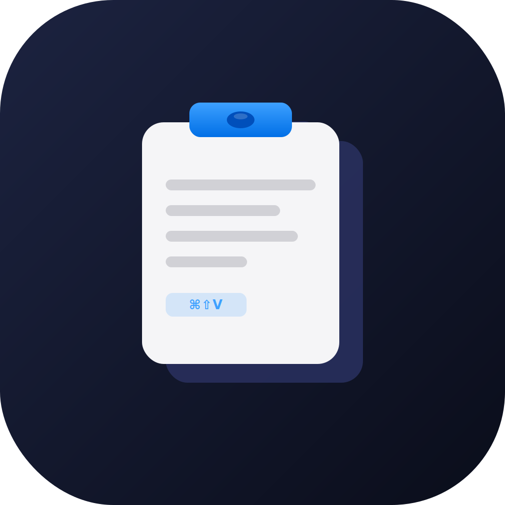

<p align="center">
  
</p>

# Kclip

A free, open-source, **keyboard-first** clipboard manager for macOS.

> **Experimental personal tool** — built for personal use and shared as-is.
> No warranties, no guaranteed updates. Use it, fork it, break it.

---

## Features

| Shortcut | Action |
|---|---|
| `⌘⇧V` | Open the Spotlight-style clipboard panel from **anywhere** |
| `↑ ↓` | Navigate the list |
| `⏎` | Paste the selected item |
| `⌥⏎` | Paste the selected item as plain text |
| `1 – 0` | Instantly paste items 1–10 (fastest workflow) |
| `⌘1 – ⌘5` | Instantly paste items 11–15 |
| `⌘⌫` | Delete the selected item (works during search too) |
| `⌘Z` | Undo the last delete |
| `⌘P` | Pin / unpin the selected item (works during search too) |
| `Space` | Preview the full content of the selected item |
| `Type anything` | Filter clipboard history in real time |
| `Esc` | Close preview overlay, or dismiss the panel |

### Why no mouse?

Kclip is designed so that your hands **never leave the keyboard**:

1. Copy something → `⌘C` (as usual)
2. Copy more things → keep going
3. Press `⌘⇧V` → panel appears
4. Press `1` / `2` / `3` … or navigate with arrows → paste instantly
5. Panel closes automatically — you're back in your app

### Full-Content Preview

Press `Space` on any item to open a scrollable overlay showing the complete text.
From the preview you can:
- Press `⏎` or click **Paste** to paste it
- Press `Esc` to close and return to the list
- Select text with the mouse (`.textSelection(.enabled)`) to copy a portion

### Pinning

Press `⌘P` (or right-click → Pin) to pin items to the top of the list.
Pinned items are **never** removed by the history limit or "Clear all".

### Menu Bar

- **Left-click** the menu bar icon → open/close the panel
- **Right-click** the menu bar icon → status menu with:
  - **Launch at Login** — toggles whether Kclip starts automatically
  - **History Size** — choose 10, 15, 25, or 50 items (default: 15)
  - **Hotkey** — choose from ⌘⇧V (default), ⌘⇧C, ⌃⇧V, ⌥⇧V, or ⌘⇧B
  - **Quit Kclip**

---

## Privacy

Kclip **never captures clipboard content** copied from password managers.

The following apps are excluded by default:

- 1Password (all versions)
- Bitwarden
- LastPass
- Dashlane
- Enpass
- KeePassium / KeePassXC / KeePassX
- Apple Passwords (macOS 15+)

You can add your own exclusions via Terminal:

```bash
defaults write cc.kclip.app cc.kclip.excludedBundleIDs -array \
  "com.example.MyPasswordApp"
```

---

## Requirements

- macOS 13 Ventura or later
- Xcode 15+ (to build from source)
- **Accessibility permission** (needed to simulate ⌘V paste; prompted on first launch)

---

## Building from Source

### Option A — XcodeGen (recommended, 2 commands)

```bash
# Install XcodeGen if you don't have it
brew install xcodegen

# Generate the Xcode project
xcodegen generate

# Open and build
open Kclip.xcodeproj
```

Then press ⌘R in Xcode to run.

---

### Option B — Manual Xcode Setup

1. Open Xcode → File → New → Project
2. Choose **macOS → App**
3. Set:
   - Product Name: `Kclip`
   - Bundle Identifier: `cc.kclip.app`
   - Language: Swift
   - Interface: SwiftUI
4. Delete the auto-generated `ContentView.swift` and `Assets.xcassets` if you don't need them
5. Drag the entire `Sources/Kclip/` folder into the project navigator
6. In **Build Settings**:
   - `INFOPLIST_FILE` → `Resources/Info.plist`
   - `CODE_SIGN_ENTITLEMENTS` → `Resources/Kclip.entitlements`
   - `ENABLE_HARDENED_RUNTIME` → `YES`
   - `MACOSX_DEPLOYMENT_TARGET` → `13.0`
7. Press ⌘R to run

---

## First Launch

On first launch, Kclip will:

1. Appear in your **menu bar** (clipboard icon)
2. Prompt you to grant **Accessibility permission** — this is required for the paste-simulation feature. Grant it in **System Settings → Privacy & Security → Accessibility**.
3. Start monitoring your clipboard immediately.

---

## Project Structure

```
Kclip/
├── Sources/Kclip/
│   ├── KclipApp.swift          ← @main entry point
│   ├── AppDelegate.swift          ← wires everything together
│   ├── Models/
│   │   ├── ClipboardItem.swift    ← data model
│   │   └── ClipboardStore.swift   ← observable store + persistence
│   ├── Services/
│   │   ├── ClipboardMonitor.swift ← polls NSPasteboard every 0.5 s; excludes password managers
│   │   └── HotkeyManager.swift    ← Carbon global hotkey (⌘⇧V)
│   ├── Views/
│   │   ├── FloatingPanel.swift    ← NSPanel + controller
│   │   ├── ClipboardPopupView.swift ← Spotlight-style popup UI
│   │   └── ClipboardRowView.swift   ← single list row
│   └── Utilities/
│       ├── ClipboardSearch.swift  ← multi-token AND search
│       └── PasteHelper.swift      ← CGEvent paste + AX permission
├── Tests/KclipTests/
│   ├── ClipboardItemTests.swift    ← unit tests for ClipboardItem
│   ├── ClipboardStoreTests.swift   ← unit tests for ClipboardStore
│   ├── ClipboardSearchTests.swift  ← unit tests for search logic
│   ├── ClipboardMonitorTests.swift ← unit tests for clipboard monitoring
│   └── HotkeyOptionTests.swift     ← unit tests for hotkey serialization
├── Resources/
│   ├── Info.plist
│   ├── AppIcon.svg
│   └── Kclip.entitlements
├── LICENSE
├── project.yml                    ← XcodeGen config
└── README.md
```

---

## How It Works

### Clipboard Monitoring
`ClipboardMonitor` polls `NSPasteboard.general` every 500 ms. When `changeCount` increments, the new string is passed to `ClipboardStore`. Content from password managers is silently ignored.

### Search
`ClipboardSearch` splits the query into whitespace-separated tokens and requires **all** of them to appear in the item text (case-insensitive). An empty query returns the full list.

### Global Hotkey
`HotkeyManager` uses Carbon's `RegisterEventHotKey` — the same low-level API used by Alfred and Raycast. This fires even when another app is in focus.

### Pasting
`PasteHelper`:
1. Snapshots the frontmost app **before** showing the panel
2. Sets `NSPasteboard` to the selected text
3. Re-activates the previous app
4. Fires a `CGEvent` for ⌘V via `cghidEventTap`

If no previous app was captured (e.g. cold open), the text is written to the clipboard and a "Copied to clipboard" banner is shown.

### Launch at Login
Uses `SMAppService` (macOS 13+). Toggle via the right-click status-bar menu.

### Why no App Sandbox?
Carbon hotkeys and `cghidEventTap` are not available inside the macOS App Sandbox. Kclip is distributed as a signed, notarised binary — not via the Mac App Store.

---

## Customisation Ideas

- Change the hotkey from the right-click status menu → Hotkey (⌘⇧V / ⌘⇧C / ⌃⇧V / ⌥⇧V / ⌘⇧B)
- Change history size from the right-click status menu → History Size (10 / 15 / 25 / 50)
- Add more password manager exclusions via `UserDefaults` (see Privacy section above)
- Add image/file support in `ClipboardMonitor`
- Add a preferences window with SwiftUI Settings scene

---

## Running Tests

```bash
# Generate the Xcode project (required after any project.yml change)
xcodegen generate

# Run tests from the command line
xcodebuild test -scheme Kclip -destination 'platform=macOS'
```

Or press `⌘U` inside Xcode after opening `Kclip.xcodeproj`.

---

## License

MIT — see [LICENSE](LICENSE). Do whatever you want with it.
